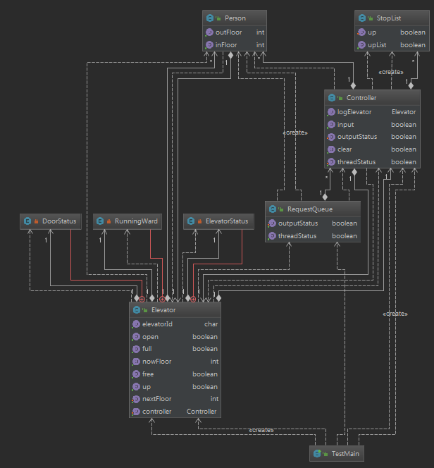
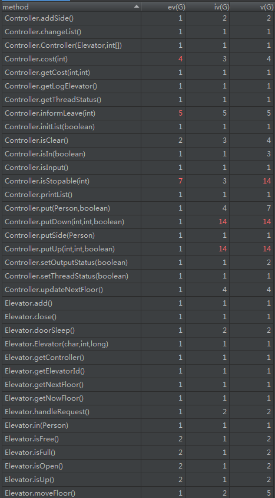

# **OO第二次作业总结——具有灵魂的电梯**

**<p align = "right">Author : 16231237 刘子豪</p>**
**<p align = "right">Finish Date: 2019.4.21</p>**

## **一.作业回顾**
---
+ **第一次**：设计仅**一台**支持**FCFS**的电梯。
+ **第二次**：设计仅**一台**支持**ALS**的电梯。
+ **第三次**：设计支持**多台任意调度（SS）**的电梯。

## **二.第一次作业分析**
---
### **2.1 设计思路**
&emsp;&emsp;由于是刚刚接触多线程，因此第一次作业的重点并不是在调度算法，而是强调**多线程架构**。

&emsp;&emsp;究其本质，这实际上就是一个典型的**生产者——消费者**模式。

### **2.2 类图与UML图**
> 该类图分析不包括PersonRequest类，同时不包含get与set类方法。

&emsp;&emsp;在本次作业这种，为了达到**分工明确**的效果，在进行类的设置上采用**类如其名**的方法进行设计。

+ Elevator类：**仅**模拟电梯的运行(Thread)
   - 成员变量及构造方法——
   <details>
   <summary> code--</summary>
   
   ```java
    private enum DoorStatus {
        OPEN, CLOSE
    }

    private enum ElevatorStatus {
        FREE, CLOSED
    }

    private static final Elevator INSTANCE =
            new Elevator(); // ONLY One Elevator

    private static long FLOOR_TIME = 500;

    private static long DOOR_TIME = 250;

    private int nowFloor; // floor now on

    private int nextFloor = -1; // floor heading to

    private DoorStatus doorStatus;

    private ElevatorStatus elevatorStatus;

    private PersonRequest processRequest;

    private Elevator() {
        this.processRequest = null;
        this.nowFloor = 1;
        this.nextFloor = 1;
        this.doorStatus = DoorStatus.CLOSE;
        this.elevatorStatus = ElevatorStatus.FREE;
    }
   ```
   </details>

   - 成员方法——
   <details>
   <summary> code--</summary>
   
   ```java
   public boolean isFree(); // if elevator is free
   public boolean isOpen(); // if elevator is open
   public long timeToNextFloor(); // get how long the elevator should run before get to the next Target Floor
   public void open(); // elevator OPEN
   public void close(); // elevator CLOSE
   public void move(); // elevator is MOVING
   public void doorSleep(); // elevator sleep during door open-close
   public void pickup(); // elevator goes to pick up a person
   public void sendout(); // elevator goes to send out the person inside
   public synchronized void handleRequest(
            PersonRequest request); // elevator is handling a request
   ```
   </details>

   - run方法——
   <details>
   <summary> code--</summary>
   
   ```java
   public void run() {
        while (Controller.getInstance()
                .getThreadStatus()
                || RequestQueue.getINSTANCE()
                .getThreadStatus()) {
            // Get the Request from controller
            // System.out.println("request");
            PersonRequest personRequest =
                    Controller.getInstance()
                            .getNextRequest();
            handleRequest(personRequest);
        }
        elevatorStatus = ElevatorStatus.CLOSED;
        // System.out.println("ElevatorOut");
    }
   ```
   </details>

+ Controller类：仅控制电梯的运行
   - 成员变量及构造方法——
   <details>
   <summary> code--</summary>
   
   ```java
    private PersonRequest nextPersonRequest; // next processing request

    private boolean threadStatus = true; // the status of the controller

    private static final Controller INSTANCE =
            new Controller(); // ONLY one Controller

    private Controller() {
        this.nextPersonRequest = null;
    }
   ```
   </details>

   - 成员函数——
   ```java
   public synchronized PersonRequest getNextRequest(); // get the next processing request
   ```

+ RequestQueue类：接受所有请求(Thread)
   - 成员变量及构造方法——
   <details>
   <summary> code--</summary>
   
   ```java
    private boolean threadStatus = true; // status of the Queue

    private ArrayList<PersonRequest> inQueue = null; // people pushed in the Queue

    private ArrayList<PersonRequest> nextQueue = null; // people waited to get in the elevator

    private ArrayList<PersonRequest> outQueue = null; // people waited to get out of the elevator

    private static final RequestQueue INSTANCE =
            new RequestQueue(); // ONLY one queue

    private RequestQueue() {
        this.nextQueue = new ArrayList<PersonRequest>();
        this.inQueue = new ArrayList<PersonRequest>();
        this.outQueue = new ArrayList<PersonRequest>();
    }
   ```
   </details>

   - 成员方法——
   <details>
   <summary> code--</summary>
   
   ```java
    public synchronized void put(PersonRequest request); // add new request
    public synchronized PersonRequest get(); // get following request
    public void in(); // let people in the elevator
    public void out(); // let people out of the elevator
   ```
   </details>

   - run方法——
   <details>
   <summary> code--</summary>
   
   ```java
    public void run() {
        while (Controller.getInstance()
                .getThreadStatus()
                || nextQueue.size() != 0
                || outQueue.size() != 0
                || inQueue.size() != 0) {
            try {
                sleep(1);
            } catch (InterruptedException e) {
                e.printStackTrace();
            }
            if (Elevator.getINSTANCE().isOpen()) {
                in();
                out();
            }
        }
        threadStatus = false;
    }
   ```
   </details>

+ UML——


### **2.3 程序核心分析**

+ 请求加入与请求获取——*RequestQueue*.**put()**&**get()**
   - **put()**：当有新请求加入到队列Queue中时，队列首先将它们统一放置在**inQueue**这个ArrayList中，然后**notifyAll()**在等待的**get()**
   - **get()**：当**controller**想要获取请求时，首先查看**inQueue**是否为空，如果为空则进入**wait()** 状态，如果存在，则取出队列中的**第一个**请求，将它移动到**nextQueue**这个等待进入电梯的队列中，并返回该请求。
+ 获取任务与完成任务——**Elevator.handleRequest(** *request* **)**
   - handleRequest中的执行顺序如下——
   <details>
   <summary> code--</summary>
   
   ```java
    public synchronized void handleRequest(
            PersonRequest request) {
        processRequest = request; // set now request
        pickup(); // pick up the person
        sendout(); // send this person
        processRequest = null; //set now request null
    }
   ```
   </details>

   - **pickup**与**sendout**的执行操作基本相似，到达目的楼层后再开门关门等待，然后判断找到下一个目标楼层。
   - 而电梯每次执行完一次**handleRequest**后，获取**controller**中存储的下一个请求**nextRequest**。

### **2.4 程序评价**
&emsp;&emsp;由于本次电梯设计并没有刻意的针对调度性能等进行处理，因此不对性能做分析。

&emsp;&emsp;这次的程序架构是完全按照**生产者——消费者**的模式来进行的。
+ 生产者：**System.in**
+ 消费者：**Elevator**
+ 托盘：*RequestQueue*.**inQueue**&**outQueue**&**nextQueue**

&emsp;&emsp;有关线程安全方面，对于可能发生冲突访问的put()和get()都进行了synchronized操作，而对并不可能发生冲突的handleRequest也进行了上锁保护。

&emsp;&emsp;因此程序的逻辑是很清楚的，并且对于同步访问能够做到很好的控制，所以**这个程序的设计是很不错的**。

> *然而尴尬的是，这可能是唯一的正面评价了*

#### **2.4.1 没有做好的while（）**

&emsp;&emsp;首先说明对于IN/OUT的输出，是RequestQueue线程中反复判断的。在实践过程中，尝试使用wait和notify机制来实现**仅开门时进行判断**，但是分析后发现，开门状态下，**elevator是sleep状态**，实际上并没有占用任何的对象锁，**无法通过共享对象使得RequestQueue获得对象锁从而启动判断**（~~至少我当时没想出来~~）。

&emsp;&emsp;因此在实际运行中，出现了时间轮转——
<details>
<summary> code--</summary>
   
```java
            try {
                sleep(1);
            } catch (InterruptedException e) {
                e.printStackTrace();
            }
            // System.out.println("judge");
            if (Elevator.getINSTANCE().isOpen()) {
                in();
                // System.out.println("in");
                out();
            }
```
</details>

&emsp;&emsp;**不用想，这一定是一个糟糕的设计！**

#### **2.4.2 糟糕的移植性**

&emsp;&emsp;这一点，在后续的作业中能够体现出来——**很多重要函数都进行了修改**。

## **三.第二次作业分析**
---

> “反正你也是要上去，就不能顺便把我送上去吗？”

> “不行，我送完这个人再来接你。”

> “谁设计了你这么个完蛋的东西！”

> “课（我）程（自）组（己）让我这么设计的。”

&emsp;&emsp;在收到了很多用户的投诉了之后，我对电梯的设计进行了修改——**使之可以捎带上能捎带的人**。

### **3.1 修改内容**
+ 增加了对目的楼层计算方法。
+ 封装ArrayList，使之成为有序不重复表。
+ 修改相关方法。

### **3.2 类图与UML**
> 避免篇幅，仅说明修改部分。

> 用于调试用的boolean变量
+ Elevator类——
   - 成员变量及构造方法——
   <details>
   <summary> code--</summary>
   
   ```java
   private enum RunningWard {
        UP, DOWN, NONE
   }
   private RunningWard direction; // moving direction

   private static long FLOOR_TIME = 400; // moving one floor sleeping time

   private static long DOOR_TIME = 200; // open/close door using time

   private Elevator() {
        this.processRequest = null;
        this.nowFloor = 1;
        this.nextFloor = -4; // illegal floor
        this.doorStatus = DoorStatus.CLOSE;
        this.elevatorStatus = ElevatorStatus.FREE;
        this.direction = RunningWard.NONE;
   }
   ```
   </details>

   - 成员方法——
   <details>
   <summary> code--</summary>
   
   ```java
   public void moveFloor(); // move one floor
   public boolean isUp(); // if the elevator is heading upward
   ```
   </details>

   - run方法
   <details>
   <summary> code--</summary>
   
   ```java
    public void run() {
        // if controller offline, it stops
        while (Controller.getInstance()
                .getThreadStatus()) {
            // if illigal floor, wait
            while (nextFloor == -4) {
                try {
                    sleep(1);
                } catch (InterruptedException e) {
                    e.printStackTrace();
                }
            }
            handleRequest(); // deal with process
        }
        elevatorStatus = ElevatorStatus.CLOSED;
        // System.out.println("ElevatorOut");
    }
   ```
   </details>

+ Controller类——
   - 成员变量及构造方法——
   <details>
   <summary> code--</summary>
   
   ```java
    private StopList[] lists; // the array of the processing floor list

    private boolean isInit = false; // if the controller is inited

    private Controller() {
        this.lists = new StopList[3];
        lists[0] = new StopList();
        lists[1] = new StopList();
        lists[2] = new StopList();
    }
   ```
   </details>
   - 成员方法——
   <details>
   <summary> code--</summary>
   
   ```java
   public void initList(boolean isUp); // init the stoplists
   public void changeList(); // change the priorty of stoplists
   public void updateNextFloor(); // set new nextfloor for the elevator
   public void informLeave(int floor); // elevator is going to leave this floor
   public void put(PersonRequest request); // put new request into different stoplist
   public void putUp(int fromFloor, int toFloor); // put the upwards request into list
   public void putDown(int fromFloor, int toFloor); // put the downwards request into list
   ```
   </details>

+ RequestQueue类——
   - 成员变量及构造方法——
   <details>
   <summary> code--</summary>
   
   ```java
   private boolean outputStatus = true; 
   // if has following new request
   // actually its name should be inputStatus

   ```
   </details>

   - 成员方法——
   > *由于无其他出了set和get以外的新方法，因此本部分略去。*
   - run方法——
   <details>
   <summary> code--</summary>
   
   ```java
    public void run() {
        // only no output and no people wait can it stop
        while (this.outputStatus
                || outQueue.size() != 0
                || inQueue.size() != 0) {
            try {
                sleep(1);
            } catch (InterruptedException e) {
                e.printStackTrace();
            }
            // System.out.println("judge");
            if (Elevator.getInstance().isOpen()) {
                in();
                // System.out.println("in");
                out();
            }
        }
        threadStatus = false;
        // System.out.print("Queue out\n");
    }
   ```
   </details>

+ StopList类——封装好的有序无重复的ArrayList类。
   - 成员变量及构造方法——
   <details>
   <summary> code--</summary>

   ```java
    private ArrayList list; // the ArrayList

    private boolean isUp; // the runningWard of the list.

    public StopList() {
        this.list = new ArrayList();
    }
   ```
   </details>

   - 成员方法——

   <details>
   <summary> code--</summary>
   
   ```java
   public boolean isUpList(); // get the runningWard of this list
   public int size(); // get size of this list
   public boolean contains(int floor); // whether this list contains the floor
   public int get(int index); // get the object according to the index
   public void put(int floor); // put the floor into the list
   public void remove(int floor); // remove the floor from the list
   ```
   </details>
+ UML——


### **3.3 程序核心分析**

#### 3.3.1 3个StopList的循环列表
<details>
<summary>code--</summary>

```java
public void changeList() { // recircle the lists order
        StopList tempList = lists[0];
        lists[0] = lists[1];
        lists[1] = lists[2];
        lists[2] = tempList;
        lists[2].setUp(lists[0].isUpList());
    }

    public void initList(boolean isUp) {
        lists[0].setUp(isUp); // main processing thread
        lists[1].setUp(!isUp); // next thread
        lists[2].setUp(isUp); // wait thread
        this.isInit = true;
    }
```
</details>

&emsp;&emsp;本次电梯采用的是**ALS**调度策略，即电梯存在**主请求**与**可携带请求**。在电梯处理一个请求时，如果发现**该停靠楼层**有其他可以上电梯的乘客，则可以将该乘客携带进电梯。

&emsp;&emsp;然而在设计中，我**将请求拆分为楼层进行处理**，其目的是——电梯可以直接通过获取停靠楼层列表的值来进行目的获取，而不是针对某一请求，这样可以使得在判断是否经停时可以直接获取值，**而不需遍历**

&emsp;&emsp;举个例子：假设0时刻电梯的主请求为1-14，运行期间分别收到了3-11，4-12，5-13这三个附带请求，加到携带列表中。那么电梯每到一层，就需要即时**在携带列表中遍历**是否需要停靠。这样一来**处理时间会延长，CPU运转时间也会增大**。而拆分为楼层后，只需要将**当前运行列表的楼层最小值**进行赋值即可。另外，如果同期还收到了13-8的请求，第一种方法下该乘客不属于可携带范围内，无法乘坐电梯，但拆分为楼层后该乘客可以登上电梯。

&emsp;&emsp;因此，**主请求**就被转变为了**主停靠列表**中的**最大最小值**。

&emsp;&emsp;接下来分析新请求与当前电梯运行情况的关系。
+ 如果主请求列表为空，那么新请求自然而然成为了当前列表的最值。
+ 如果新请求与主列表方向一致——
   + 情况a：电梯可以直接捎带该乘客。
   + 情况b：电梯想捎带该乘客需要先掉头接送。
+ 如果运行方向不一致——
   + 情况c：出发楼层比主列表的最后楼层还要远。
   + 情况d：出发楼层并没有主列表最后楼层那样远。

&emsp;&emsp;设置了3个StopList，其类型分别为——
+ list[0]：主停靠列表
+ list[1]：下一停靠列表，**方向与主停靠列表相反**
+ list[2]：第三停靠列表，**方向与主停靠列表相同**
> *以下简称列表1，列表2，列表3*

&emsp;&emsp;如果列表1为空，那么列表2将成为主列表（列表1），列表3也将成为下一列表（列表2），列表1将直接变成第三列表（列表3），并修改方向。而**controller**中将请求加到正确列表中就成为了最重要的一环。

+ 对于情况a：**直接将该请求楼层加入到列表1中。**
+ 对于情况b：该请求只能等到第二次进行执行同方向运行时才可以进行，**即加入到列表3中**，不过如果在列表2中存在出发楼层，则不用添加到列表3中.
+ 对于情况c：**首先将出发楼层加入到列表1中，再将目的楼层加入到列表2中。**
+ 对于情况d：**直接加入到列表2即可，如果列表1中有出发楼层，可省略。**

&emsp;&emsp;而当controller收到第一个请求时，由于未确定初始方向，因此需要对列表进行**init**操作，为列表设计方向。而初始化方向的依据即初始方向。

```java
if (isInit == false) {
        initList(nowFloor < fromFloor);
    }
```

> *然而，该设计存在巨大漏洞，会在bug分析处进行说明*

#### 3.3.2 目的楼层可以随时更新

&emsp;&emsp;电梯的下一目标楼层**nextfloor**它可以在以下两种情况下通过调用方法**updateNextFloor()** 被更新——
+ 情况一：电梯从某层关门离开后，**controller**通过方法**informLeave(int floor)** 被告知电梯离开，可以调用方法设置新的楼层。
+ 情况二：当有新请求出现时，在**controller**的**put(PersonRequest request)** 方法末尾，会调用该方法。

&emsp;&emsp;而电梯在运行的过程中，每到一层可以判断是否和已经设置的**nextFloor**相等，如果相等则开门。而在未收到新请求的情况下，讲其设置为-4，即**不可达楼层**，而在电梯等待请求过程中，若为-4则可以继续进行等待而不用运行。

> *此处也存在bug，尤其是和上面的bug在一起的情况下*

#### 3.3.3 线程安全

&emsp;&emsp;除了上一次作业中出现的线程安全控制外，本次作业中还对setNextFloor()做了synchronized控制，保证设置新楼层时只能有一个方法在运行。

### **3.4 程序性能**

&emsp;&emsp;由于在原有的携带请求基础上，对于反方向的可停靠请求也能够被携带上，因此**性能上较ALS略优**，但依旧有可优化空间。

### !!**3.5 重大bug**

> 尽管我不想承认，但是bug就这么实实在在发生了。

#### 3.5.1 StopList的初始化

&emsp;&emsp;在stopList初始化的时候，判断条件是出发楼层和目的楼层的大小关系，那么对于如下情况：
> *电梯初始楼层1层，新请求：15——4*

&emsp;&emsp;根据设计，主列表将存储15和4，而电梯的初始方向也将变为UP。问题出现了——**主列表方向与电梯运行方向不一致**。

&emsp;&emsp;而当上升过程中出现了4——15的请求时，该请求应该被当做可携带请求加入到列表1中，但是由于方向错误，此处电梯的执行将出现混乱，会将该请求加入到列表2中……

&emsp;&emsp;因此，正确的初始化，应该是与电梯的第一次运行方向有关，正确代码应如下——
<details>
<summary>code--</summary>

```java
            if (isInit == false) {
                boolean isUp;
                // System.out.println("init");
                if (nowFloor < fromFloor) {
                    isUp = true;
                } else if (nowFloor > fromFloor) {
                    isUp = false;
                } else {
                    if (fromFloor < toFloor) {
                        isUp = true;
                    } else {
                        isUp = false;
                    }
                }
                initList(isUp);
            }
```
</details>
&emsp;&emsp;这个bug也在下一次作业中被修正。

#### 3.5.2 三列表的加入条件

> *这也是这次作业其中一个测试点没通过的原因*

&emsp;&emsp;初版设计中，出现新请求时，只要方向一致并且出发楼层满足携带条件即可放进主列表。以上升为例：只要新请求也是上升请求并且出发楼层**大于等于**当前楼层即可放进主列表。

> *乍一看好像没什么问题对吧...*

&emsp;&emsp;现在我们来看一个情况——电梯主列表存储为{4,8,15}，在电梯刚刚离开4层后，电梯主列表变为了{8,15}，此时电梯的楼层仍然为4层。而就在上升过程中，controller由收到了一条4——12的请求。由于4层电梯已经离去，因此该请求不满足携带条件，应该放进列表3。但是判断条件是**大于等于**，因此请求会被加入到主列表，并且4会被作为下一楼层设置给电梯。

&emsp;&emsp;而等电梯到达5层后，发现自己到达的不是4层，就继续走，一直走到4396层……

&emsp;&emsp;因此，判断条件应从**大于等于**改为**大于**，下降情况同理。

&emsp;&emsp;然而问题又出现了，如果请求来的时候电梯并没有离开，那么该请求可以被放进主列表。而放进列表3后，乘客的确可以进入进入电梯，但目的楼层不再主列表，很可能过了很久该乘客才能出电梯。并且由于列表3中依旧存在出发楼层，电梯很有可能要开一次空门……

&emsp;&emsp;因此最佳判断条件应同时考虑**电梯的状态**。这一Bug在下一次作业中被基本修正。

## **四.第三次作业分析**

> “只有一个电梯你好意思吗？”

> “抱歉，电梯故障！现在修好了！”

&emsp;&emsp;经过了一周的检修后，终于又有两个电梯能够投入使用了。

&emsp;&emsp;设计架构与上一次作业相似，**每个controller控制1个elevator, 任务分配由RequestQueue执行**。

### **4.1 修改内容**

+ 引入多电梯管理系统
+ 修复第二次作业中的bug
+ 修改线程机制

### **4.2 类图与UML**

> 同样的，对于已有方法和set/get类方法不进行特殊标注。

+ Elevator类——
   - 成员变量及构造方法——
   <details>
   <summary>code-- </summary>

   ```java
    private char elevatorId; // id of the elevator
    private Controller controller; // the controller of this elevator
    private int maxNumber; // the maxmium volume
    private volatile int personNum; // the people number inside the elevator
    private ArrayList<Person> insideList; // which people in the elevator

    public Elevator(char id, int maxNumber,
                    long floorTime) {
        // private
        this.elevatorId = id;
        this.maxNumber = maxNumber;
        this.floorTime = floorTime;
        // public
        this.insideList = new ArrayList<Person>();
        this.controller = null;
        this.personNum = 0;
        this.nowFloor = 1;
        this.nextFloor = -4; // illegal floor
        this.doorStatus = DoorStatus.CLOSE;
        this.elevatorStatus = ElevatorStatus.FREE;
        this.direction = RunningWard.NONE;
    }
   ```
   </details>

   - 成员方法——
   <details>
   <summary>code--</summary>

   ```java
   public boolean isFull(); // if the elevator is full
   public void add(); // personNum++
   public void in(Person person); // person in the elevator
   public void remove(Person person); // person removed from the elevator
   public void out(); // let people inside out
   ```
   </details>

   - run方法——
   <details>
   <summary>code--</summary>

   ```java
    public void run() {
        // if controller offline, it stops
        while (RequestQueue.getInstance().isThreadStatus()) {
            // if illigal floor, wait
            if (nextFloor == -4) {
                try {
                    sleep(50);
                } catch (InterruptedException e) {
                    e.printStackTrace();
                }
            } else {
                // Get the Request from controller
                // System.out.println("request");
                handleRequest(); // deal with process
                elevatorStatus = ElevatorStatus.FREE;
            }
        }
        elevatorStatus = ElevatorStatus.CLOSED;
        // System.out.printf("Elevator %c Out\n", elevatorId);
    }
   ```
   </details>

+ Controller类——
   - 成员变量及构造方法——
   <details>
   <summary>code--</summary>

   ```java
    private Elevator logElevator; // control which elevator
    private int[] stopFloors; // which floor does the elevator stops
    private ArrayList<Person> waitList; // reserved for people has to wait

    public Controller(Elevator logElevator, int[] stopFloors) {
        this.lists = new StopList[3];
        lists[0] = new StopList();
        lists[1] = new StopList();
        lists[2] = new StopList();
        this.stopFloors = stopFloors;
        this.logElevator = logElevator;
        this.isInput = false;
        waitList = new ArrayList<Person>();
        logElevator.setController(this);
    }
   ```
   </details>
   
   - 成员方法——
   <details>
   <summary>code--</summary>
   ```java
   public boolean isClear(); // if there is no floor to stop
   public boolean isIn(boolean isWait); // reserved for put()
   public boolean isStopable(int floor); // is this floor able to stop
   public int cost(int floor); // get the cost for stopping at this floor
   public int getCost(int inFloor, int outFloor); // get the cost for this request
   public void putSide(Person person); // put the request into a waitList
   public void addSide(); // add the waitList into the circled lists
   public void put(Person person, boolean isWait); // rewrite the put()
   ```

   </details>

+ RequestQueue类——
   - 成员变量及构造方法——
   <details>
   <summary>code--</summary>

   ```java
    private ArrayList<Controller> controllerList; // list of controllers
    private boolean isIn = false; // if the queue has received requests.

    private RequestQueue() {
        this.nextQueue = new ArrayList<PersonRequest>();
        this.inQueue = new ArrayList<PersonRequest>();
        this.outQueue = new ArrayList<PersonRequest>();
        this.threadStatus = true;
        this.controllerList = new ArrayList<Controller>();
    }
   ```
   </details>

   - 成员方法——
   <details>
   <summary>code--</summary>
   
   ```java
    public void addController(Controller controller); // add a controller into the list
    public ArrayList<Controller> directChoice(
            ArrayList<Controller> directList, int inFloor, int outFloor); // get the choice elevator for the direct request.
    public ArrayList partChoice(ArrayList<Controller> inList,
            ArrayList<Controller> outList, int inFloor, int outFloor); // get the choice elevators for the 2-part request.
    public ArrayList analyze(PersonRequest request); // analyze the request and get its take-lift list.
   ```
   </details>

   - run方法——
   <details>
   <summary>code--</summary>

   ```java
    public void run() {
        while (threadStatus) {
            boolean isOut = true;
            if (!outputStatus) {
                for (int i = 0; i < controllerList.size(); i++) {
                    if (!controllerList.get(i).
                            isClear()) {
                        isOut = false;
                        break;
                    }
                }
                // System.out.println(isOut);
                if (isOut && isIn) { // has received request and can be out
                    threadStatus = false;
                    break;
                }
            }
            try {
                sleep(100);
            } catch (InterruptedException e) {
                e.printStackTrace();
            }
        }
    }
   ```
   </details>

+ StopList类：省略——

+ Person类：模拟每个请求，即用户。

   - 成员变量及构造方法——
   <details>
   <summary>code--</summary>

   ```java
    private PersonRequest request; // request of this person
    private Elevator targetLift; // which elevator he will take
    private Elevator nextElevator; // if need transfer, which elevator
    private int inFloor; // the floor he will get in
    private int outFloor; // the floor he will get out
    private boolean finishFlag; // if this person finish his request
    private boolean waitFlag; // if he needs to transfer one time
    private boolean testOutput = false; // flag for the debug
    private boolean inFlag; // if the person has been in the elevator

    public Person(PersonRequest request, boolean waitFlag, Elevator targetLift) {
        this.request = request;
        this.waitFlag = waitFlag;
        this.targetLift = targetLift;
        this.nextElevator = null;
        this.finishFlag = false;
        this.inFlag = false;
    }
   ```

   </details>

   - 成员方法——
   <details>
   <summary>code--</summary>
   ```java
   public void init(int stopFloor, Elevator nextElevator); // init this person according to its transfer floor
   public void in(); // person in
   public void out(); // person out
   ```
   </details>

   - run方法——
   <details>
   <summary>code--</summary>
   ```java
    public void run() {
        if (testOutput) {
            if (nextElevator == null) {
                System.out.printf(
                        "%d is on run, %d~~%c~~%d\n",
                        request.getPersonId(),
                        inFloor, targetLift.getElevatorId(),
                        outFloor);
            } else {
                System.out.printf(
                        "%d is on run, %d~~%c--%c~~%d\n",
                        request.getPersonId(), inFloor,
                        targetLift.getElevatorId(),
                        nextElevator.getElevatorId(), outFloor);
            }
        }
        while (finishFlag == false) {
            if (targetLift.isOpen() && !inFlag) {
                if (targetLift.getNowFloor() == inFloor) {
                    if (testOutput) {
                        System.out.printf(
                                "ready in %d\n", request.getPersonId());
                    }
                    in(); // full judged inside
                }
                // out exceeded by elevator
            }
            try {
                sleep(100);
            } catch (InterruptedException e) {
                e.printStackTrace();
            }
        }
        if (testOutput) {
            System.out.printf("%d over\n", request.getPersonId());
        }
    }
   ```

   </details>

+ UML——



### **4.3 核心程序分析**

#### 4.3.1 线程机制修改

&emsp;&emsp;在前两次作业设置中，控制人员进出的是**RequestQueue**，而不是用户本身。但是在和某位**dalao**进行交流后，深得体会。按照建模的角度来思考，用户本身是判断进出的执行者，因此**每一个用户都应该作为一个线程**，在存活时间内完成电梯乘降。

> *但说实话，改了还不如不改……*

&emsp;&emsp;由于电梯到达某一楼层后，同层上电梯的人员存在竞争关系，而由于进电梯决定权交给了用户，因此**电梯执行效率会发生降低**，尤其是当遇到类似下述情况时——
<details>
<summary>测试样例</summary>

```txt
2-FROM--2-TO-17
3-FROM--2-TO-15
4-FROM--2-TO-16
5-FROM--2-TO-18
6-FROM--2-TO-19
7-FROM--2-TO-20
8-FROM--2-TO-17
29-FROM--2-TO-15
10-FROM--2-TO-16
11-FROM--2-TO-18
12-FROM--2-TO-19
```

</details>

&emsp;&emsp;对于目的楼层相同的人，很大几率并不能一次直接全部进入，导致电梯效率变差。

#### 4.3.2 电梯调度策略

> *优化什么的搞得人头都大了*

&emsp;&emsp;电梯调度策略和上一次作业差不多，仍然延续了**3个循环列表**的机制。

&emsp;&emsp;每台电梯的任务分配由与之绑定的controller设置，而controller的任务来源于总的RequestQueue的分配。而分配给哪个电梯是由如下因素决定的——
+ 出发楼层、目的楼层是否可达。（必要因素）
+ 楼层信息是否存在在已分配楼层列表中。（代价因素）
+ 电梯人数（优化目标）
+ 运行方向（优化目标）

&emsp;&emsp;由于每台电梯停靠楼层范围不同，因此首先需要判断电梯能否完成该请求。任务的分配原则是——**能一个电梯完成就一个电梯完成，** 即用户尽量不中途换乘。而如果一定要换乘，也**只换乘1次。**

&emsp;&emsp;在分析停靠楼层后我发现，所有电梯都能到达的楼层：**1层和15层**，一次选择这两个楼层作为唯二的换乘楼层。

&emsp;&emsp;而对于楼层是否已在分配过得楼层列表中，判断依据是**最后列表**，即判断该楼层停靠的轮次是电梯的第几次任务执行，**越靠后的代价越高。** 再结合是否换乘等因素，选择最终乘坐电梯序列，并对该Person进行初始化。

<details>
<summary>具体代码思路如下</summary>

```java
// Controller.java
    public int cost(int floor) {
        if (lists[0].contains(floor)) {
            return 1;
        } else if (lists[1].contains(floor)) {
            return 10;
        } else if (lists[2].contains(floor)) {
            return 100;
        } else {
            return 1000;
        }
    }

    public int getCost(int inFloor, int outFloor) {
        return cost(inFloor) + cost(outFloor);
    }

```
</details>

#### 4.3.3 人员进出

&emsp;&emsp;由于本次作业中加入了电梯载客限制，因此乘客上电梯前必须优先判断电梯是否超载。而为了满足人员可以最多数量的进入电梯，和多数公共场合的电梯运行情况一样——**先下后上**。

&emsp;&emsp;因此，人员进出的策略应该是这样的：电梯到达楼层后，先让电梯内的乘客下电梯，然后显示状态为OPEN，接着所有乘客（Person）收到信号后开始竞争性的进入电梯。而竞争性进入电梯的问题在前文已经叙述过，存在一定的问题。

#### 4.3.4 备用列表

&emsp;&emsp;当电梯内人满为患时，有些电梯已经处理过的请求，停靠列表已经被加入到了电梯中，如果人没上来怎么办？这个请求还能被加回来吗？

&emsp;&emsp;当然可以，采用的方法是——对于没有挤上电梯的人，将他们放置在一个**waitList**中。等到当前列表停靠请求执行完了之后，电梯进行**stopList**的循环，然后再将waitList中所有请求重新添加到这个循环列表中。

&emsp;&emsp;然而有个问题最后没有解决——电梯中存储的失效请求没有被删除。因此电梯可能会在错误楼层停靠一次。

#### 4.3.5 线程安全

&emsp;&emsp;除了前两次作业中的同步访问控制，这一次还对elevator/person的in/out操作也进行控制，保证了电梯的人数是不会发生互斥访问的。

### **4.4 调试bug**

&emsp;&emsp;本次电梯在调试时发现了很多bug，很多问题在上面的分析中已经得到解决。然而，最神奇的bug往往发生在最无法想象的地方。

#### 4.4.1 进程结束

&emsp;&emsp;本次电梯中，由于存在换乘，因此即使当前状态下无后续输入并且电梯也无请求，**电梯进程也无法结束**。3个电梯要停必须一起停才可以。

&emsp;&emsp;因此最终的版本中，采用了通过共享RequestQueue的threadStatus来控制电梯结束。

#### 4.4.2 volatile

&emsp;&emsp;这也是个神奇的bug，在电梯有人上电梯时，经常会发现访问电梯内乘客数量时**没有更新**，在同学提醒下加了volatile之后结果就莫名其妙地正确了。分析后认为可能是因为**变量未及时更新**造成的问题，而volatile带来的可见性能够避免这个问题。


## **五.电梯小结**
---
&emsp;&emsp;本次电梯的设计是循序渐进的，从单一电梯到多电梯，从傻瓜调度到灵活调度，在多线程上面逐渐开始变得适应和习惯。程序虽然没有对**轮转**这个问题做最后的改进，但是没有出现较大问题也算是可喜可贺的一件事情。

&emsp;&emsp;但不得不说，程序还是有一些小的问题。例如对于同步访问的控制有些缺陷，有关面向对象的机制并没有把控的很完美，也没有很好的利用java自带的库（如concurrent）实现代码的完美化。这在后续的作业中还需要进行提升。

&emsp;&emsp;除此以外，从调度算法角度上来讲，自己的心思研究并不深入，最后的调度策略性能很差，也导致最后没有一个好的分数。

## **附录——程序的度量分析**
参考资料——[某dalao写过的OO博客](https://www.cnblogs.com/Arrow0/p/10595012.html)

### **Complexity Metrics**

+ **ev(G)**：**Essential Complexity**，用来表示一个方法的结构化程度，范围在 **[1,v(G)]** 之间，**取值越小程序越良好**。
+ **iv(G)**：**Design Complexity**，用来表示一个方法与其他方法的紧密程度，范围在 **[1,v(G)]** 之间，**取值越大证明关系越紧密**。
+ **v(G)**：即循环复杂度，可理解为穷尽程序流程每一条路径的实验次数。
+ **OCavg**：类的方法的平均循环复杂度。
+ **WNC**：类的方法的总循环复杂度。

### **第一次作业——**


### **第二次作业——**


> *一看这次写的就很有问题。*

### **第三次作业——**




> *还是上次那些毛病。*

