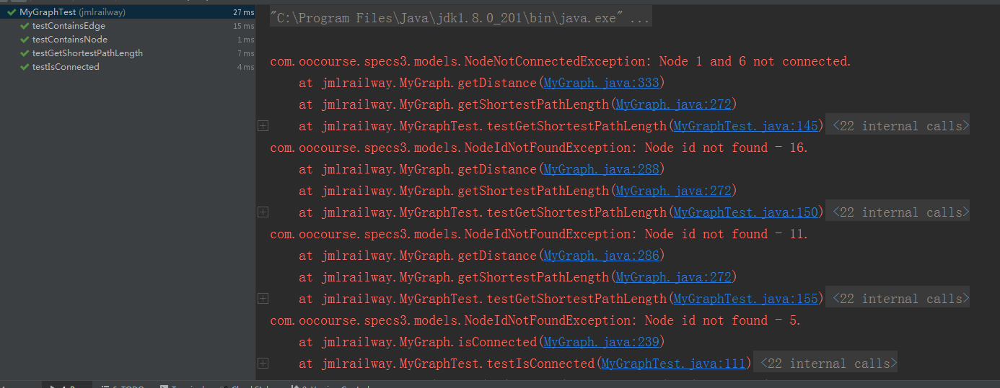
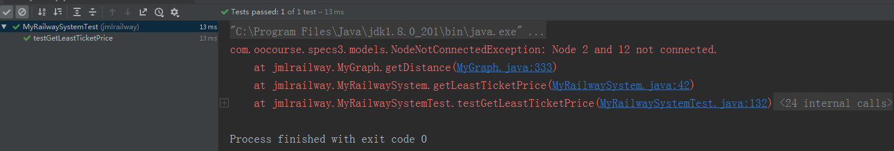

# OO第三次作业——听我话好好写JML

## **作业回顾**

+ **第一次：** 根据JML规格实现**Path**和**PathContainer**类。
+ **第二次：** 根据JML规格实现无向图**Graph**系统。
+ **第三次：** 根据JML规格实现铁路**Railway**系统。

&emsp;&emsp;总结来说，这次作业 **~~实际上就是对JML语言的学习~~** 。

&emsp;&emsp;明明就是打着JML的幌子考验算法@X@。

## **JML总结**

&emsp;&emsp;**JML——Java Modeling Language**，正如其名是对Java语言做出的规格化约束而诞生的语言。在工程或者交互的开发中，彼此协作需要清楚明确接口间的数据约束，**而通过JML语言来实现对开发人员的限制以及规范**，并可以通过相应测试工具进行自主化测试。

&emsp;&emsp;**JML**提供的规格约束大致有以下几类——

+ **normal_behavior**：规定了方法的正确执行结果。

+ **exceptional_behavior**：当方法出现了异常情况时的执行结果。

+ **requires**：规定了方法的参数以及当前状态的约束条件，可以认为是对应的behavior出现的前提。

+ **ensures**：方法运行中或者结束后满足的状态。

+ **assignable**：方法运行结束后被修改的内容。

+ **model**：抽象类中的数据抽象。

+ **pure**：该方法不对任何数据进行修改。

+ **constraint**：任何对对象的修改都必须遵守的要求。

+ **invariant**：不变式，即在任何时刻对象需要满足的要求。

+ 量词类，如：**\forall**，**\exists**，**\nothing**

+ 其它诸如 **\old**，**\result**等。

&emsp;&emsp;例如，一个完整的JML规格可以长成这个样子——

```java
    /*@ normal_behavior
      @ requires path != null && path.isValid();
      @ assignable pList, pidList;
      @ ensures (\exists int i; 0 <= i && i < pList.length; pList[i] == path &&
      @           \result == pidList[i]);
      @ ensures (\forall int i; 0 <= i && i < \old(pList.length);
      @          containsPath(\old(pList[i])) && containsPathId(\old(pidList[i])));
      @ also
      @ normal_behavior
      @ requires path == null || path.isValid() == false;
      @ assignable \nothing;
      @ ensures \result == 0;
      @*/
    public int addPath(Path path){}
```

&emsp;&emsp;当然，很多时候对于requires这一约束并不明确，因为协作时传入的参数不一定满足条件，那么很多时候的JML规格会完美的符合~~甜甜的~~**KISS**原则。

> KISS——keep it stupid and simple，简单来说，每个coder都是一个潜在的智障。

## **JUnit测试**

&emsp;&emsp;使用JUnit测试对MyGraph和RailwaySystem进行测试。




## **JMLUnitNG测试**

&emsp;&emsp;恕臣妾无能，到死也没搞出来这个应该怎么去实现……

&emsp;&emsp;本着对OpenJML的学习，自己手写了新的测试程序TestJML.java来进行测试。

&emsp;&emsp;测试结果如下——

```code
Passed: racEnabled()
Passed: constructor Demo()
Passed: static compare(-2147483648, -2147483648)
Passed: static compare(0, -2147483648)
Passed: static compare(2147483647, -2147483648)
Passed: static compare(-2147483648, 0)
Passed: static compare(0, 0)
Passed: static compare(2147483647, 0)
Passed: static compare(-2147483648, 2147483647)
Passed: static compare(0, 2147483647)
Passed: static compare(2147483647, 2147483647)
Passed: static main(null)
Passed: static main({})
```

## **架构分析**

### **第一次作业**

> 代码千万行，注释第一行。读题不规范，强测两行泪。

&emsp;&emsp;第一次作业就是~~单纯地~~实现JML规格的填充，正常来讲能够读懂题看清楚规格要求就行了。

> *那你真的就是太天真了。*

&emsp;&emsp;最终强测的时候居然还是测了性能，对于没做什么维护的我直接凉了……

### **第二次作业**

> 能力有限不要一上来就想着优化。

&emsp;&emsp;第二次作业吸取了第一次作业的教训，在开始阶段就规划图的架构。

&emsp;&emsp;考虑到图中的情况是**结点数>>路径数**，因此多数的结点都会只存在在一条路径上，也就是说他们在求解图信息时会充当不重要角色。（后文给出解释）

&emsp;&emsp;首先说明数据结构——

1. Node类：图的结点信息。

```java
    private HashMap<Integer, ArrayList> pathList; // record which path this node is in and its place list.

    private HashMap<Node, Integer> lengthTable; // record its distance map.
```

2. Route类：图的边信息。

```java
    private int number; // route id

    private Node node1; // one node of this route

    private Node node2; // the other node of this route

    private int distance; // the distance between this two node

    private int pathId; // which path this Route is on
```

3. GraphData类：（单例模式）存储图信息。

```java
    private HashMap<Integer, Path> pathMap; // record paths data

    private HashMap<Integer, Node> nodeMap; // record nodes data

    private HashMap<Node, Integer> graph; // record graph data

    private ArrayList<Route> routeList; // record routes data
```

4. MyPath类：存储路径信息。

```java
    private ArrayList<Integer> nodes; // record nodes

    private ArrayList<Integer pathList; // record which paths it can reach to

    private HashMap<Node, ArrayList<Integer>> interNodeList; // record its interNodes.
```

5. MyGraph类：存储图信息。

```java
    private ArrayList<Path> pathList; // init pathList

    private ArrayList pidList; // init pidList
```

&emsp;&emsp;接下来说明架构细节——

> Define ：满足以下条件的被称为交叉结点：

> （1）该结点存在在两条路径上。

> （2）该结点在一条路径上具有两个位置。

+ 结点分为两类，**裸结点**和**交叉结点**，图的构建只需要交叉结点即可。

+ 当有路径增减时，将所有的交叉结点构建在图（GraphData）的信息中，之后执行Dijkstra算法，存储所有交叉结点间的路径长度信息，并更新路径可达表（path.pathList）。

+ 当求算两结点间距离时：
   
   - 如果是两个交叉结点，直接在图中求值即可。
   - 如果是一个交叉结点和一个裸结点，则从裸结点所在路径上的所有交叉结点作为访问入口，然后遍历求最小值即可。
   - 如果是两个裸结点，则两边都进行遍历取最小值即可。
   - 对于本就在同一条路径上的两点，可直接根据位置计算距离。再将该距离与上述所得的距离进行比较，取最小值。

+ 当求两点间是否连通时，根据结点所在path遍历判断是否在对应列表中。

&emsp;&emsp;这样架构的优势在于——对于复杂度为O(n^2)的dijkstra来讲，将n缩小到了一个特别特别小的量级，因此在做dijkstra时算法的复杂度将降低。

&emsp;&emsp;不过由于后续相当庞大的计算工程，实际上在针对本次作业的**少增减，多查询**机制下，效果并不一定好，反而会出现TLE的问题。

### **第三次作业**

&emsp;&emsp;第三次作业实现铁路系统，除了对距离的运算外，还需要考虑不满意度，票价和换乘次数计算。事实上，由于计算方式与计算距离类似，因此对原getShortestDistance函数进行修改即可。

<details>

<summary>查看源码</summary>

```java
    // add arg mode to control calculate what kind value
    public int getDistance(int i, int i1, String mode) 
            throws NodeNotConnectedException,
            NodeIdNotFoundException {
        GraphData graphData = GraphData.getInstance();
        if (!graphData.containsNodeId(i)) {
            throw new NodeIdNotFoundException(i);
        } else if (!graphData.containsNodeId(i1)) {
            throw new NodeIdNotFoundException(i1);
        }
        Node node1 = graphData.getNodeById(i);
        Node node2 = graphData.getNodeById(i1);
        Node pathNode1 = null;
        Node pathNode2 = null;
        HashMap interNodeList1 = null;
        HashMap interNodeList2 = null;
        if (node1.isInterNode()) {
            pathNode1 = node1;
        }
        if (node2.isInterNode()) {
            pathNode2 = node2;
        }
        int distance = 9999999;
        int distance1 = 9999999;
        distance = node1.samePath(node2, mode);
        if (pathNode1 != null && pathNode2 != null) {
            distance1 = graphData
                    .getDistanceInterNodes(pathNode1, pathNode2, mode);
        } else if (pathNode1 == null && pathNode2 != null) {
            distance1 = graphData
                    .getDistanceInterNode(pathNode2, node1, mode);
        } else if (pathNode1 != null && pathNode2 == null) {
            distance1 = graphData
                    .getDistanceInterNode(pathNode1, node2, mode);
        } else {
            distance1 = graphData
                    .getDistance(node1, node2, mode);
        }
        // with the value through interNodes, needs minus operation
        if (distance1 != 0) {
            if (mode.equals("Distance")) {
                distance1 = distance1;
            } else if (mode.equals("Price")) {
                distance1 = distance1 - 2;
            } else if (mode.equals("Unhappy")) {
                distance1 = distance1 - 32;
            } else if (mode.equals("Inter")) {
                distance1 = distance1 - 1;
            }
        }
        if (distance1 < distance) {
            distance = distance1;
        }
        if (distance >= 9999967) {
            throw new NodeNotConnectedException(i, i1);
        }
        return distance;
    }
```

</details>

## **调试bug分析**

&emsp;&emsp;调试时出现了很多很多很多很多问题。如第二次作业的dijkstra数值更新出错，第三次作业中的Route更新出错等等，好在通过正确的方式都进行了弥补。

&emsp;&emsp;然而本次作业仍有一个bug没有挑出来，这也是第三次作业中测倒下的原因——存在环路的不满意度计算。

&emsp;&emsp;设想在path中有这样一条路径——

> 1-->2-->4-->5-->6-->4-->7-->8-->6-->6-->11-->4-->11-->2

&emsp;&emsp;现在我们要计算1-->5这样一条路径。那么我们可以得到很多条路径……

线路|距离|不满意度
:--:|:--:|:---:
1-->2-->4-->5|3|528
1-->2-->11-->6-->5|4|64
1-->2-->4-->11-->6-->5|5|560
1-->2-->11-->4-->5|4|544

&emsp;&emsp;由于单源路径中的环节点出现的原因，从一个位置到达另一个位置将会有很多条路径出现。就比如**1-->2-->4-->5**这条路径来说，第一眼这条路径一定是最优的，但是由于4的存在，不满意度变得很高，相反其他更长的路径反而成了最优解。

&emsp;&emsp;这个bug的原因，出在**route**的构建上。

&emsp;&emsp;前文提到，图是由交叉结点构成的，而**路径经过交叉结点并不代表一定换乘。**而route在进行存储的时候，对边的权重在进行计算时是**默认换乘的**，即如果是计算不满意度就将算完的不满意度再 **+32**，用这种方式算出的1-->2-->11-->6-->5这条路径的不满意度就变成了——

> 64 + 32 * 2 = 128

&emsp;&emsp;然而至今我也没有想出这个bug应该怎样去修改，或许路径内环是这个算法的死穴吧。

## **个人感悟**

> 说是JML，其实还是一个工程作业。

&emsp;&emsp;这次作业真的不止一个惨字能够很好的形容了。

+ 第一次作业：没仔细读题，compare方法不是按照字典序写的。
+ 第二次作业：dijkstra数据信息更新有问题。
+ 第三次作业：unpleasantValue碰到路径内闭环直接崩溃。

&emsp;&emsp;如果非要总结一点经验教训的话，总结起来就是——

> 工程千万行，审题第一条，架构不规范，凉凉。

&emsp;&emsp;JML真的是个好东西，他好就好在**好麻烦**啊！但也难怪，因为它对所有的操作的细节都说的很明确，不麻烦才怪。更何况，提供了你SMT Solver你还想怎样！！


