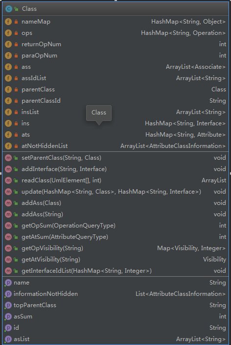

# 老司机到站了——OO总结博客

## UML作业总结

&emsp;&emsp;本单元任务对UML的内容进行了学习，在进行OO内容学习的同时，也将对其中的UML建模知识进行相应了解。

### 第一单元——UML类图

&emsp;&emsp;第一单元中，主要是针对UML类图进行整理与操作。根据课程组提供的阅读内容，对UML类图的信息进行整理。

> 但是dump出来的一条条信息看着有点不舒服，**感觉还是原始的json格式的数据好看一点**

#### 基础架构设计

&emsp;&emsp;首先考虑UML类图中的元素，其结构为——

+ UMLClass
   - UmlOperation
      - UmlParameter
   - UmlAttribute
   - UmlInterfaceRealization
   - UmlGenerealization
   - UmlAssociation
      - UmlAssociationEnd

+ UmlInterface
   - UmlGenerealization
   - UmlOperation
   - UmlAssociation
      - UmlAssociationEnd

&emsp;&emsp;第一次阅读的时候，给我的感觉就是……**这不就是语法分析吗？**

&emsp;&emsp;因此在最后的架构上，写的就像极了语法分析的分析程序……

```java
        for (int i = 0; i < elements.length; i++) {
            UmlElement element = elements[i];
            if (element.getElementType() == ElementType.UML_CLASS) {
                String id = element.getId();
                String name = element.getName();
                if (nameMap.containsKey(name)) {
                    nameMap.get(name).add(id);
                } else {
                    ArrayList list = new ArrayList();
                    list.add(id);
                    nameMap.put(name, list);
                }
                Class newClass = new Class(id);
                ArrayList list = newClass.readClass(elements, i);
                list.addAll((ArrayList)list.get(0));
                i = (int)list.get(1);
                classList.put(id, newClass);
            } else if (element.getElementType() == ElementType.UML_INTERFACE) {
                String id = element.getId();
                String name = element.getName();
                if (nameMap.containsKey(name)) {
                    nameMap.get(name).add(id);
                } else {
                    ArrayList list = new ArrayList();
                    list.add(id);
                    nameMap.put(name, list);
                }
                Interface face = new Interface(id);
                ArrayList list = face.readInterface(elements, i);
                list.addAll((ArrayList)list.get(0));
                i = (int)list.get(1);
                interList.put(id, face);
            }
        }
```

&emsp;&emsp;由于各种Uml元素之间存在结构上的关系及存储结构，因此又对每个uml建立了新的类。


&emsp;&emsp;例如，在class的类图就如下所示……



&emsp;&emsp;在进行读取的时候，直接对class/interface/operation/association进行添加即可。

#### 关联/继承关系再处理

&emsp;&emsp;在进行关联信息和继承、实现关系添加的时候，容易出现一种情况——**关联或者继承的另一个类没有被定义**。也就是说，在association在进行记录的时候，很有可能只有一端被记录。

&emsp;&emsp;因此，所有涉及到两个UML元素的信息，在进行添加的时候，都要等待所有类，接口定义只有再重新整理添加。

#### 潜在bug——parentId与定义类不同

&emsp;&emsp;在进行测试的时候，发现了具有嵌套类定义的测试样例。由于是采用了**语法分析**的阅读模式，在readClass的过程中，只有遇到非class内内容的时候会退出class的阅读模式，从而等待阅读下一个class或者interface。

&emsp;&emsp;然而，当遇到嵌套类时，会出现小的问题——

```java
public class A {
    public class B {
        int c;
    }
    int d;
}
```

&emsp;&emsp;在进行信息的dump时，出现的顺序是——

```text
class A
class B
int c
int d
```

&emsp;&emsp;在进行信息读取的时候，读取过程为——

+ A.readClass()
   - B.readClass()
      + c
      + d

&emsp;&emsp;的确这个阅读是有问题的，在进行嵌套类内容的分析时就会出现问题。**正确的做法应该是根据parentId**进行处理。

### 第二单元——UML顺序图与状态图

&emsp;&emsp;UML也提供了顺序图与状态图的建模，本次作业就也要对顺序图和状态图进行处理。根据课程组提供的信息的处理，整理得到uml信息的结构……

+ UmlstateMachine
   - UmlRegion
      + UmlPseudoState
      + UmlState
      + UmlTransition
         + UmlEvent
      + UmlFinalState

+ UmlInteraction
   + UmlLifeline
   + UmlMessage

+ UmlAttribute

#### 类图信息

> 毕竟是最后一次作业了，得好好架构一下了……

&emsp;&emsp;类图构建很简单，**实现了功能上的分类**。


+ data：数据处理部分
+ diagramclass：类图部分
+ diagramorder：顺序图部分
+ diagramstate：状态图部分

&emsp;&emsp;对于状态图与顺序图的信息整理，与类图的结构类似，**依旧采用的是一级一级的整理**。

#### 多次阅读模式

&emsp;&emsp;根据上次的经验教训，这次不再使用原始的语法分析模式，而是根据parentId进行查找处理。

&emsp;&emsp;考虑到uml的信息可能并不是十分的有序，因此在进行阅读时候要采用多次阅读模式，如此保证**相关信息读入时，父节点已经读入完毕**。

&emsp;&emsp;

```java
    readUmlElementsFirstTime(elements);
    readUmlElementsSecondTime(elements);
    readUmlElementsThirdTime(elements);
    assUpdate();
    machineUpdate();
    classUpdate();
```

&emsp;&emsp;每次阅读时，读取的元素内容分别为——

+ 第一次——
   - UmlClass
   - UmlInterface
   - UmlAssociation
   - UmlStateMachine
   - UmlInteraction
   
+ 第二次——
   - UmlAttribute
   - UmlAssociationEnd
   - UmlGenerealization
   - UmlInterealization
   - UmlOperation
   - UmlRegion
   - UmlLifeline
   - UmlMessage

+ 第三次——

   - UmlParameter
   - UmlState
   - UmlFinalState
   - UmlPseudoState
   - UmlTransition

> 其他内容由于本次未用到因此就没有进行处理。

#### 静态检查处理

&emsp;&emsp;在进行静态检查的时候，需要判断的内容有——

+ 类/接口的循环继承
+ 属性名与关联对端的重名问题
+ 重复继承

&emsp;&emsp;重名问题比较好解决，只需要判断下对应的Map<Name, List>中对应name的list尺寸是否多于1个即可。如果考虑到associate的对端，在进行遍历时，判断对端的name是否存在于一个set中，如果已经存在，那么就会报错。

```java
    public HashSet<AttributeClassInformation> checkR1() {
        HashSet<AttributeClassInformation> set = new HashSet<>();
        Iterator<Map.Entry<String, ArrayList<Attribute>>> iter
                = attrs.entrySet().iterator();
        // check duplicated attr
        while (iter.hasNext()) {
            Map.Entry<String, ArrayList<Attribute>> entry = iter.next();
            ArrayList list = entry.getValue();
            if (list.size() >= 2) {
                AttributeClassInformation info =
                        new AttributeClassInformation(
                                entry.getKey(), this.name);
                set.add(info);
            }
        }
        // check associateEnd
        HashSet<String> endName = new HashSet<>();
        for (int i = 0; i < assIdList.size(); i++) {
            Associate as = assList.get(i);
            String id = assIdList.get(i);
            String name = as.getEndName(id);
            if (name == null) {
                continue;
            }
            if (attrs.containsKey(name)) {
                AttributeClassInformation info =
                        new AttributeClassInformation(name, this.name);
                set.add(info);
            } else {
                if (endName.contains(name)) {
                    AttributeClassInformation info =
                            new AttributeClassInformation(name, this.name);
                    set.add(info);
                } else {
                    endName.add(name);
                }
            }
        }
        return set;
    }
```

&emsp;&emsp;对于循环继承问题，首先先检查对**parentClass本身是否存在循环继承**。若未检测到循环继承，则检测所有实现接口，是否在已经存在的接口集合中存在，若没有则加入到集合中，再依次访问parentClass和接口列表。

```java
    public void checkR2() throws UmlRule008Exception {
        ArrayList<String> tempList = new ArrayList<>(classList);
        HashSet<UmlClassOrInterface> wrongSet = new HashSet<>();
        while (tempList.size() > 0) {
            Class tempClass = (Class)elementMap.get(tempList.get(0));
            ArrayList<String> list = new ArrayList<>();
            int pl = tempClass.findClassId(list);
            tempList.removeAll(list);
            if (pl >= 0) {
                for (int i = pl; i < list.size(); i++) {
                    String id = list.get(i);
                    wrongSet.add(((Class)elementMap.get(id)).getUmlElement());
                }
            }
        }

        tempList = new ArrayList<>(interList);
        while (tempList.size() > 0) {
            Interface inter = (Interface)elementMap.get(tempList.get(0));
            HashSet<String> idList = new HashSet<>();
            HashSet<String> checkList = new HashSet<>();
            HashSet<UmlInterface> tempWrongSet = new HashSet<>();
            inter.findInterfaceId(idList, checkList, tempWrongSet);
            tempList.removeAll(idList);
            wrongSet.addAll(tempWrongSet);
        }
        if (wrongSet.size() > 0) {
            throw new UmlRule008Exception(wrongSet);
        }
    }
```

&emsp;&emsp;在检查重复实现时，将所有的已实现接口加入到一个集合中，如果发现——

```java
int size = set.size() + inList.size();
set.addAll(inList);
if (size != set.size()) {
    return false;
}
```

&emsp;&emsp;当发现size大小不匹配的时候，则认为该class/interface存在接口重复实现。

```java
    public boolean getInterfaceList(HashSet<Interface> set) {
        int size = set.size() + inList.size();
        set.addAll(inList);
        if (size != set.size()) {
            return false;
        }
        if (parentClass != null) {
            boolean isOk = parentClass.getInterfaceList(set);
            if (!isOk) {
                return false;
            }
        }
        for (int i = 0; i < inList.size(); i++) {
            Interface inter = inList.get(i);
            boolean isOk = inter.getInterfaceList(set);
            if (!isOk) {
                return false;
            }
        }
        return true;
    }
```

## OO进化史

&emsp;&emsp;一次又一次的OO作业，锻炼了很多的内容，架构也进行了一次又一次的升级。

### 第一单元

&emsp;&emsp;第一次是针对多项式的测试，其中涉及到的架构思路升级——

+ 第一次：分不清楚怎么类的功能，结构等定义

+ 第二次：对类的功能实现功能性划分

+ 第三次：实现对类的继承，和接口的实现来进行处理

### 第二单元

&emsp;&emsp;第二次是电梯相关，是第一次接触线程操作。

+ 第四次：首次引入多线程操作，使用consumer-producer的传统线程操作。

+ 第五次：引入了synchrozied的同步保护操作，通过对对象的同步化访问来实现对数据的控制。

+ 第六次：将线程操作转换为将乘客作为线程，提供实际化。

### 第三单元

&emsp;&emsp;第三次是JML的作业，实际上实现的是一个图……

+ 实现了无向图的构建，实现类似于C语言中的指针结构。

+ 实现了类功能的分类，将数据类与功能类进行区分。

### 第四单元

&emsp;&emsp;UML图构建。

+ 进行包的分类，更好处理。

+ 语法分析结构，分类处理。

## OO领悟史

&emsp;&emsp;在每次的学习过程中，逐渐学会了很多的知识。

+ java基本语法的学习
   - 类的实质含义
   - 方法的可见性及调用规则
   - 基本数据结构，如HashMap和ArrayList
   - set和get类的方法

+ java的多线程机制
   - 有关wait, sleep, notify的了解
   - 同步/互斥访问机制
   - synchronized的使用方法
   - volatile的作用
   - 如何避免多线程的死锁操作

+ java的规格化语言——JML
   - JML的基本语法结构
   - 复杂的规格化语言的应用。
   - JML的normal和exceptional behavior
   - Junit的测试方式

+ java的结构语言——UML
   - UML的基本类图信息
   - UML的顺序图的应用及建模方式。
   - UML的状态图的建模，以及状态图的实际内容。

## OO测试史

&emsp;&emsp;在进行作业完成的同时，需要同时对代码进行测试自主测试处理。

+ 自动生成实例，进行输入测试与比对
+ 人为生成复杂实例，针对特别功能进行针对性测试
+ 使用Junit进行测试，自动检测出相应错误。

## 致OO课程组的一些话——

&emsp;&emsp;首先感谢课程组对我这一个学期的~~折磨~~，啊不对，是耐心指导。尽管任务量很大很大很大，大到好几次自己都调不完bug，但是**课程组的课程设计工作做得真的很认真**。从题目设计，到课后指导，再到课上讲解，能够看到课程组的用心。

&emsp;&emsp;难度设计上，的确很有层次感的合理性，提供的公开数据也有助于我们进行调试。

&emsp;&emsp;如果说要讨论一下课程的不足之处，那就勉强提几点吧。

&emsp;&emsp;首先，**题目的发布略有一些不准时**。有几次作业中，本身周末是很有时间的，但由于指导书并没有按时发布，导致任务完成变得稍微紧张起来。

&emsp;&emsp;其次，**下次作业题目最好能够有所预告**。由于每一单元的内容是逐渐深入的，由于难度梯度递增，因此前期任务小很容易早期完成，如果可以的话，希望能将后期作业内容有一个预告，便于在空闲时间进行架构设计。

&emsp;&emsp;最后，讨论区是一个很好的场景，**但是讨论区的更新有的时候并不是很及时发现**。希望日后的讨论能够通过某种形式通知到人，并且最好的话可以采用更加方便的形式进行讨论。

**最后，再次感谢课程组一学期来的照顾！！**

正如老师讲的那样，**经历过训练之后才能学会OO**。经历了折磨后，OO也就学会了。


